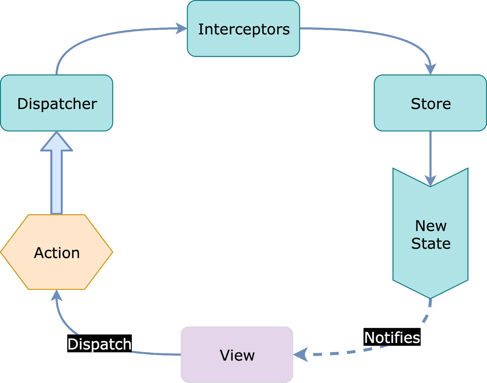

# Fluxy
[](https://jitpack.io/#hoop-carpool/fluxy)
[](https://jitci.com/gh/hoop-carpool/fluxy)


# What it's all about
Fluxy its a flow arquitecture implementation. 




## Why flux?
- Single information flow
- Single source of truth
- Reactivity

## Where this implementation comes from
This library its created from https://github.com/minikorp/mini

But with a few diferences:
- Full courroutines implementation
- 0 auto gen code
- Easy to understand the core logic

## Components
### _Dispatcher_ : each time an action was dispatched give it to proper stores.

```kotlin
val dispatcher = Dispatcher()
dispatcher.dispatch(MyAction())

```

### _State_ : represents an immutable state of an application.

```kotlin
data class MyState(val number: String = "")
```

### _Action_ : define a use case, can be synchronous or an asynchronous operation

```kotlin
data class MyAction(val number: String) : BaseAction
```

### _Store_ : is a hoder for a state and has _Reducer_ functions. 

```kotlin
class MyStore : FluxyStore<MyState>() {

    init {
        reduce<MyAction> {
            state.copy(number = it.number)
        }
    }
}
```

### _Reducer_ is a pure function that takes an action and current state returning a new state.

## How to install

```groovy
allprojects {
    repositories {
    	maven { url "https://jitpack.io" }
    }
}
dependencies {
    implementation "com.github.hoop-carpool.fluxy:fluxy:x.y.z"  
    implementation "com.github.hoop-carpool.fluxy:timberlogger:x.y.z" // Optional default logger implementation using Timber
}
```
